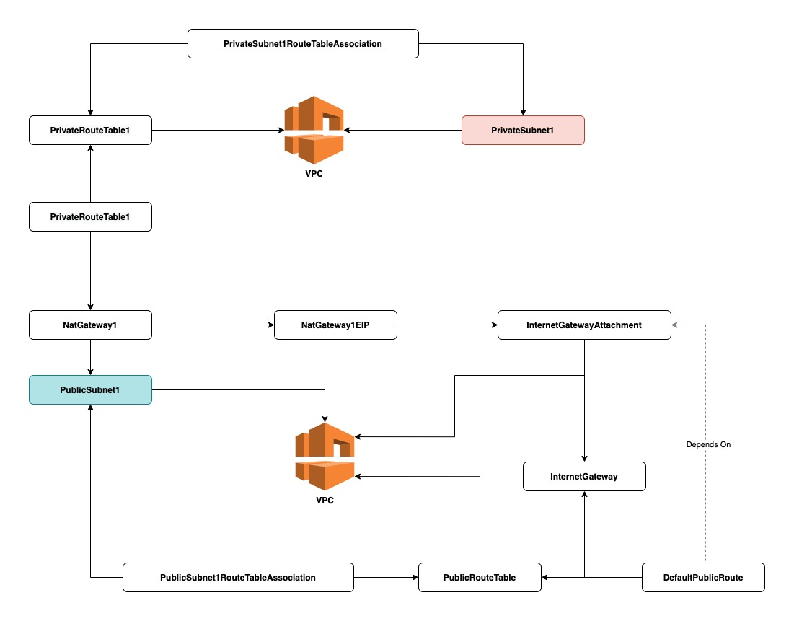

# Cloud Formation - VPC

By Anthony Vilarim Caliani

This template deploys a VPC, with one public and one private subnets spread across the first Availability Zone.
It also deploys an internet gateway, with a default route on the public subnets.
Finally, a pair of NAT gateways (one in each AZ), and default routes for them in the private subnets will be deployed too. 

### Study Reference
- [Cloud Formation - VPC](https://docs.aws.amazon.com/pt_br/AWSCloudFormation/latest/UserGuide/aws-resource-ec2-vpc.html)
- [Cloud Formation - VPC Template](https://docs.aws.amazon.com/en_us/codebuild/latest/userguide/cloudformation-vpc-template.html)